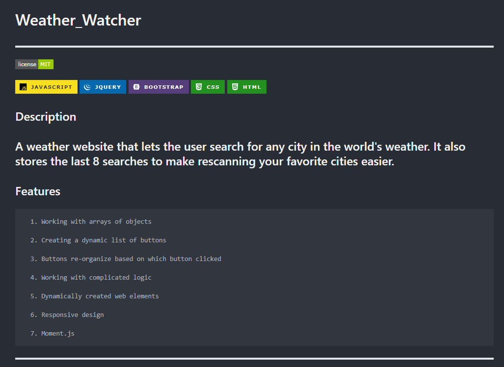
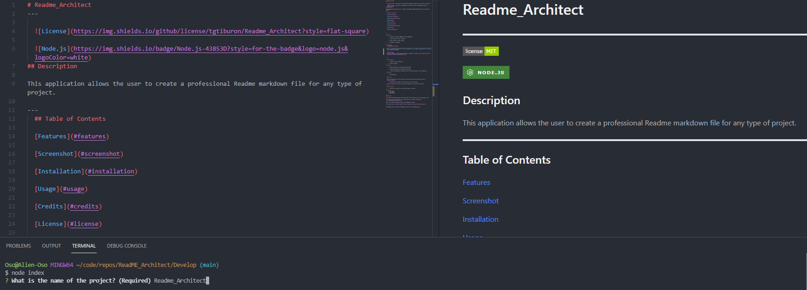

# Readme_Architect
---

  
  
   
## Description

This application allows the user to create a professional Readme markdown file for any type of project. 

---
  ## Table of Contents

  [Features](#features)

  [Screenshot](#screenshot)

  [Installation](#installation)
    
  [Usage](#usage)
    
  [Credits](#credits)
    
  [License](#license)
    
  [Contributing](#contributing)
    
  [Tests](#tests)

  [Questions](#questions)
  
  

---

## Features

      1. Generates a complete README from the commandline 

      2. Links directly to your repository 

      3. Links directly to your License 

      4. Includes a screenshot. 
---

## Screenshot 
  

  
 **Here is a screenshot showing how to enter information with the inquirer prompt and how it shows up in the readme as markdown.**

  
  [Here is a link to a video showing me generate a Readme file](https://drive.google.com/file/d/1soa3qjEEMhE1Rb5K3XjW1956j46D0z1M/preview)
  
  

  ---

  ## Installation

      1. Clone from my git repository 

      2. install inquirer. 
---
  ## Usage

      1. Type node index.js from the develop directory. 

      2. Answer the questions as detailed as possible. 

      3.  Place the readme and screenshot files in the main directory of your repository. 
---
  ## Credits

      1. img.shields.io 

  ---
  ## License 

  &emsp; 

      To read about the license of this project click the link below.

  &emsp;[License](https://github.com/tgtiburon/Readme_Architect/blob/main/LICENSE) 

  ---
  ## Contributing

      1. Contact me via email or the issues tracker on the repo. 
---
  ## Tests
      1. Run test 1 
      2. Run test 2 
      3. Run Test 3 

---
## Questions

If you have any questions about this project feel free to email me at <tg.tiburon@gmail.com>.  

To see the rest of my portfolio, visit [Github](https://github.com/tgtiburon).

Below is a graphic displaying my most used languages on github.

This Readme file was created with Readme Architect by Tony Gendreau &copy;
